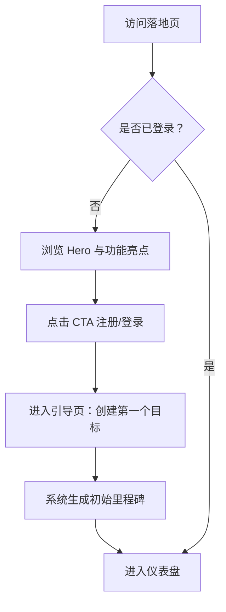
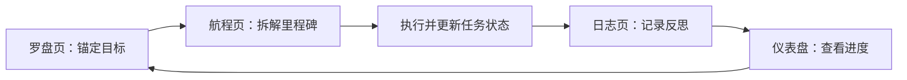

# Compass 产品需求文档（PRD）

## 1. 产品概述

Compass 是一款面向独立思考者与长期主义者的「个人方向与目标导航系统」。它以航海罗盘为隐喻，帮助用户在复杂生活中锚定目标、规划航程、记录轨迹，并通过可视化反馈持续校准前进方向。

产品核心价值：把模糊的人生/职业方向转化为可追踪、可复盘、可调整的目标网络，让每一次选择都更接近真正的北方。

## 2. 核心功能

### 2.1 用户角色

| 角色 | 注册方式 | 核心权限 |
|------|----------|----------|
| 普通用户 | 邮箱 + 密码 或 OAuth（GitHub / Google） | 创建目标、规划航程、记录日志、查看仪表盘 |
| 访客 | 无需注册 | 仅浏览产品落地页，无法使用核心功能 |

### 2.2 功能模块

1. **落地页（Landing）**：品牌叙事、核心卖点、CTA 引导注册/登录。
2. **仪表盘（Dashboard）**：今日聚焦、目标进度总览、最近日志、待办里程碑。
3. **罗盘页（Compass）**：可视化目标分布罗盘，支持四象限/方位拖拽布局。
4. **航程页（Voyage）**：目标拆解为里程碑与任务，支持时间线与看板视图。
5. **日志页（Logbook）**：进展记录、周期性复盘、心情/能量标记。
6. **个人中心（Profile）**：账户信息、主题偏好、数据导出。

### 2.3 页面详情

| 页面名称 | 模块名称 | 功能描述 |
|----------|----------|----------|
| 落地页 | Hero 区域 | 全屏动态罗盘背景，品牌口号，注册入口 |
| 落地页 | 功能亮点 | 三个核心场景卡片：锚定、航行、校准 |
| 仪表盘 | 今日聚焦 | 展示当前优先级最高的 1 个目标与 3 个待办任务 |
| 仪表盘 | 进度总览 | 环形图/仪表盘展示目标完成率、里程碑达成数 |
| 仪表盘 | 最近日志 | 最近 3 条日志摘要，支持快速新增 |
| 罗盘页 | 罗盘画布 | 以正北/东南西北为轴，展示不同人生领域的目标分布 |
| 罗盘页 | 目标卡片 | 每个目标以可拖拽卡片呈现，显示进度与截止日期 |
| 航程页 | 目标列表 | 所有目标列表，支持筛选（进行中/已完成/已暂停） |
| 航程页 | 里程碑时间线 | 单个目标下的里程碑与任务，按时间线排列 |
| 航程页 | 看板视图 | 任务按状态（待办/进行中/已完成）拖拽切换 |
| 日志页 | 日志编辑器 | 支持 Markdown 轻量语法、标签、心情能量评分 |
| 日志页 | 日志时间轴 | 按周/月聚合的历史日志，支持搜索与筛选 |
| 个人中心 | 账户设置 | 修改用户名、邮箱、密码 |
| 个人中心 | 偏好设置 | 主题切换（深海 / 羊皮纸）、通知开关、数据导出 |

## 3. 核心流程

### 3.1 用户首次使用流程

用户打开落地页 → 被品牌叙事吸引 → 点击「开始航行」注册 → 完成引导式首次目标创建 → 进入仪表盘 → 系统根据目标生成初始航程与建议里程碑。

### 3.2 目标管理流程

用户在罗盘页创建/拖拽目标 → 进入航程页拆解里程碑与任务 → 在日志页记录执行反馈 → 仪表盘实时汇总进度 → 用户根据反馈调整目标优先级或方向。

### 3.3 日志复盘流程

用户定期进入日志页 → 选择复盘周期（日/周/月） → 填写进展、心情、能量 → 系统生成「航程报告」摘要 → 用户根据报告决定下一步行动。

## 4. 用户界面设计

### 4.1 设计风格

**整体方向：深海航海仪器 × 现代极简主义**

- **主色调**：深海墨蓝 `#0B1426` 作为背景主色，象牙白 `#F5F1E8` 作为文字主色，黄铜金 `#C9A227` 作为强调色与交互高亮色。
- **辅助色**：潮汐青 `#4A7C82`（次要信息）、珊瑚橙 `#D97757`（警告/高优先级）、星光银 `#A8B4C4`（边框与分隔线）。
- **按钮风格**：主按钮使用黄铜金边框 + 深色填充，悬停时泛出微光；次要按钮为描边透明按钮，悬停时背景填充 10% 金色。
- **字体选择**：
  - 标题字体：Cormorant Garamond（衬线，优雅、有航海日志气质）
  - 正文字体：Source Sans 3（无衬线，清晰易读）
  - 数据/数字：JetBrains Mono（等宽，仪表读数感）
- **布局风格**：左侧固定导航栏 + 右侧主内容区；内容以卡片化模块组织， generous 留白；罗盘页采用全屏沉浸式画布。
- **图标/图形**：使用 Lucide 图标，关键图标（罗盘、锚、船舵、望远镜）进行自定义描边处理；背景加入 subtle 的星图/航海图纹理。

### 4.2 页面设计概览

| 页面名称 | 模块名称 | UI 元素 |
|----------|----------|----------|
| 落地页 | Hero 区域 | 深色全屏背景、动态罗盘玫瑰、大标题「Find Your True North」、CTA 按钮 |
| 落地页 | 功能亮点 | 三张竖向卡片，每张配自定义图标、标题、简短描述 |
| 仪表盘 | 今日聚焦 | 大字号目标标题、进度环、3 个任务复选框、截止日期 |
| 仪表盘 | 进度总览 | 环形进度图、目标总数、已完成里程碑数、连续记录天数 |
| 仪表盘 | 最近日志 | 日志卡片列表、快速新增按钮、标签云 |
| 罗盘页 | 罗盘画布 | 中心罗盘玫瑰、四象限区域、可拖拽目标卡片、方位标签 |
| 罗盘页 | 目标卡片 | 进度条、优先级色点、标题、截止日期、hover 浮起效果 |
| 航程页 | 里程碑时间线 | 垂直时间线、节点圆点、任务列表、状态标签 |
| 航程页 | 看板视图 | 三列看板（待办/进行中/已完成）、拖拽手柄、卡片阴影 |
| 日志页 | 日志编辑器 | Markdown 工具栏、心情能量滑块、标签输入、保存按钮 |
| 日志页 | 日志时间轴 | 月份分组、折叠展开、搜索框、筛选标签 |
| 个人中心 | 账户设置 | 表单输入框、头像上传、保存/取消按钮 |
| 个人中心 | 偏好设置 | 主题切换开关、通知开关、导出 JSON 按钮 |

### 4.3 响应式设计

- **桌面优先（1440px 基准）**：左侧 240px 固定导航，主内容区最大宽度 1280px，居中或左对齐。
- **平板（768px–1024px）**：导航栏收缩为图标栏，卡片网格由 3 列变为 2 列。
- **移动端（<768px）**：底部标签栏替代侧边导航，罗盘画布支持手势缩放与拖拽，表单全宽展示。
- **触控优化**：所有可交互元素最小 44×44px 触控区域；拖拽操作在移动端提供替代编辑入口。

### 4.4 动画与微交互

- **页面加载**：Hero 区域标题逐字淡入（stagger 80ms），罗盘玫瑰缓慢旋转（20s 一周）。
- **卡片交互**：hover 时卡片 Y 轴上浮 4px，阴影扩散，金色边框亮度提升。
- **进度更新**：数字滚动动画 + 环形进度条平滑过渡（500ms ease-out）。
- **路由切换**：页面间使用共享布局淡入淡出，避免生硬跳转。
- **罗盘拖拽**：目标卡片拖拽时有磁吸感，落点有涟漪反馈。

（本产品暂无 3D 场景需求。）
