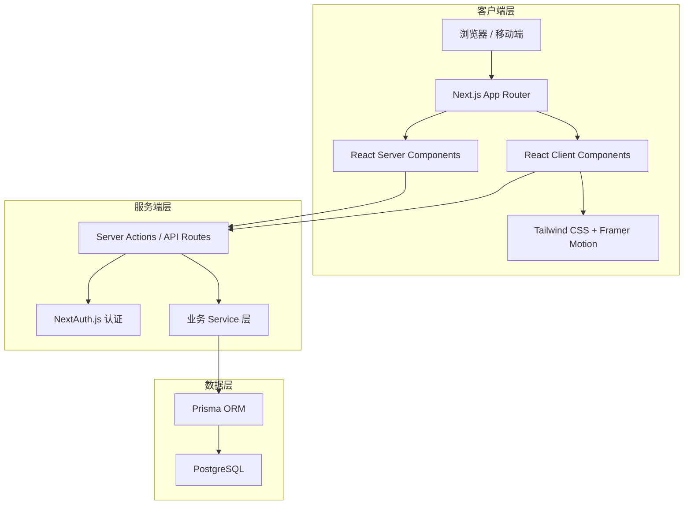
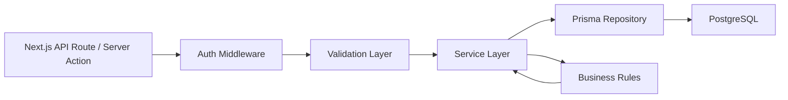
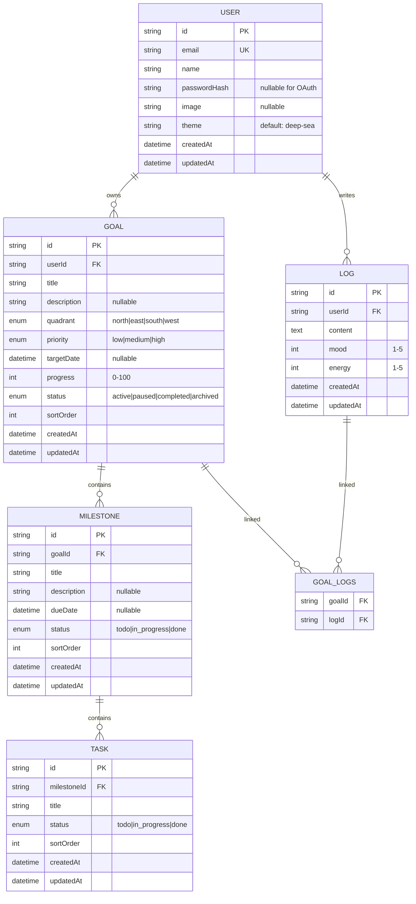

# Compass 技术架构文档

## 1. 架构设计

Compass 采用 **Next.js 14 App Router 全栈架构**，前端使用 React Server Components 与 Client Components 混合渲染，后端使用 Next.js API Routes / Server Actions 处理业务逻辑，PostgreSQL 持久化数据，Prisma 作为 ORM。认证使用 NextAuth.js，UI 使用 Tailwind CSS + Framer Motion。



## 2. 技术说明

- **前端框架**：Next.js 14（App Router），React 18
- **UI 框架**：Tailwind CSS 3.4
- **动画库**：Framer Motion
- **图标库**：Lucide React
- **状态管理**：React useState/useContext（局部状态）+ Server Actions（服务端状态）
- **后端框架**：Next.js API Routes / Server Actions
- **认证方案**：NextAuth.js（Credentials + OAuth：GitHub、Google）
- **ORM**：Prisma 5
- **数据库**：PostgreSQL 14+
- **字体**：Cormorant Garamond、Source Sans 3、JetBrains Mono（通过 next/font）
- **包管理器**：pnpm
- **代码规范**：TypeScript 严格模式、ESLint、Prettier
- **部署目标**：Vercel / 自建 Node.js 服务器

## 3. 路由定义

| 路由 | 用途 | 类型 |
|------|------|------|
| `/` | 落地页 | 页面 |
| `/login` | 登录页 | 页面 |
| `/register` | 注册页 | 页面 |
| `/onboarding` | 首次引导：创建第一个目标 | 页面（需登录） |
| `/dashboard` | 仪表盘 | 页面（需登录） |
| `/compass` | 罗盘画布：目标可视化 | 页面（需登录） |
| `/voyage` | 航程规划：里程碑与任务 | 页面（需登录） |
| `/voyage/[goalId]` | 单个目标详情 | 页面（需登录） |
| `/logbook` | 日志与复盘 | 页面（需登录） |
| `/profile` | 个人中心 | 页面（需登录） |
| `/api/auth/[...nextauth]` | NextAuth.js 认证接口 | API 路由 |
| `/api/health` | 服务健康检查 | API 路由 |

## 4. API 定义

### 4.1 目标（Goal）

```typescript
// GET /api/goals
interface ListGoalsResponse {
  goals: Goal[];
}

// POST /api/goals
interface CreateGoalRequest {
  title: string;
  description?: string;
  quadrant: 'north' | 'east' | 'south' | 'west';
  priority: 'low' | 'medium' | 'high';
  targetDate?: string; // ISO 8601
}

interface CreateGoalResponse {
  goal: Goal;
}

// PATCH /api/goals/[id]
interface UpdateGoalRequest {
  title?: string;
  description?: string;
  quadrant?: 'north' | 'east' | 'south' | 'west';
  priority?: 'low' | 'medium' | 'high';
  targetDate?: string;
  progress?: number; // 0-100
  status?: 'active' | 'paused' | 'completed' | 'archived';
}

// DELETE /api/goals/[id]
// 204 No Content
```

### 4.2 里程碑（Milestone）

```typescript
// POST /api/goals/[goalId]/milestones
interface CreateMilestoneRequest {
  title: string;
  description?: string;
  dueDate?: string;
}

// PATCH /api/milestones/[id]
interface UpdateMilestoneRequest {
  title?: string;
  description?: string;
  dueDate?: string;
  status?: 'todo' | 'in_progress' | 'done';
}
```

### 4.3 任务（Task）

```typescript
// POST /api/milestones/[milestoneId]/tasks
interface CreateTaskRequest {
  title: string;
}

// PATCH /api/tasks/[id]
interface UpdateTaskRequest {
  title?: string;
  status?: 'todo' | 'in_progress' | 'done';
}
```

### 4.4 日志（Log）

```typescript
// GET /api/logs?period=week|month
interface ListLogsResponse {
  logs: Log[];
}

// POST /api/logs
interface CreateLogRequest {
  content: string;
  mood: number; // 1-5
  energy: number; // 1-5
  tags: string[];
  goalIds?: string[];
}
```

### 4.5 通用类型

```typescript
interface Goal {
  id: string;
  title: string;
  description?: string;
  quadrant: 'north' | 'east' | 'south' | 'west';
  priority: 'low' | 'medium' | 'high';
  targetDate?: string;
  progress: number;
  status: 'active' | 'paused' | 'completed' | 'archived';
  createdAt: string;
  updatedAt: string;
}

interface Milestone {
  id: string;
  goalId: string;
  title: string;
  description?: string;
  dueDate?: string;
  status: 'todo' | 'in_progress' | 'done';
  createdAt: string;
  updatedAt: string;
}

interface Task {
  id: string;
  milestoneId: string;
  title: string;
  status: 'todo' | 'in_progress' | 'done';
  createdAt: string;
  updatedAt: string;
}

interface Log {
  id: string;
  content: string;
  mood: number;
  energy: number;
  tags: string[];
  goalIds: string[];
  createdAt: string;
  updatedAt: string;
}
```

## 5. 服务端架构图



### 5.1 分层说明

- **API Route / Server Action**：接收 HTTP 请求或直接由组件调用，负责参数解析与响应序列化。
- **Auth Middleware**：校验 JWT Session，注入当前用户 ID，拒绝未授权请求。
- **Validation Layer**：使用 Zod 对请求体进行类型校验与业务规则初筛。
- **Service Layer**：编排业务逻辑，如创建目标时自动初始化第一个里程碑、计算目标进度等。
- **Prisma Repository**：通过 Prisma Client 执行 CRUD，封装复杂查询。
- **Business Rules**：进度计算、状态机转换、权限校验等纯函数。

## 6. 数据模型

### 6.1 数据模型定义



### 6.2 数据定义语言

```sql
-- 用户表
CREATE TABLE "User" (
    "id" TEXT PRIMARY KEY DEFAULT gen_random_uuid()::TEXT,
    "email" TEXT UNIQUE NOT NULL,
    "name" TEXT,
    "passwordHash" TEXT,
    "image" TEXT,
    "theme" TEXT NOT NULL DEFAULT 'deep-sea',
    "createdAt" TIMESTAMP(3) NOT NULL DEFAULT CURRENT_TIMESTAMP,
    "updatedAt" TIMESTAMP(3) NOT NULL DEFAULT CURRENT_TIMESTAMP
);

-- 目标表
CREATE TABLE "Goal" (
    "id" TEXT PRIMARY KEY DEFAULT gen_random_uuid()::TEXT,
    "userId" TEXT NOT NULL REFERENCES "User"("id") ON DELETE CASCADE,
    "title" TEXT NOT NULL,
    "description" TEXT,
    "quadrant" TEXT NOT NULL CHECK ("quadrant" IN ('north','east','south','west')),
    "priority" TEXT NOT NULL CHECK ("priority" IN ('low','medium','high')),
    "targetDate" TIMESTAMP(3),
    "progress" INTEGER NOT NULL DEFAULT 0 CHECK ("progress" BETWEEN 0 AND 100),
    "status" TEXT NOT NULL DEFAULT 'active' CHECK ("status" IN ('active','paused','completed','archived')),
    "sortOrder" INTEGER NOT NULL DEFAULT 0,
    "createdAt" TIMESTAMP(3) NOT NULL DEFAULT CURRENT_TIMESTAMP,
    "updatedAt" TIMESTAMP(3) NOT NULL DEFAULT CURRENT_TIMESTAMP
);
CREATE INDEX "Goal_userId_idx" ON "Goal"("userId");
CREATE INDEX "Goal_status_idx" ON "Goal"("status");

-- 里程碑表
CREATE TABLE "Milestone" (
    "id" TEXT PRIMARY KEY DEFAULT gen_random_uuid()::TEXT,
    "goalId" TEXT NOT NULL REFERENCES "Goal"("id") ON DELETE CASCADE,
    "title" TEXT NOT NULL,
    "description" TEXT,
    "dueDate" TIMESTAMP(3),
    "status" TEXT NOT NULL DEFAULT 'todo' CHECK ("status" IN ('todo','in_progress','done')),
    "sortOrder" INTEGER NOT NULL DEFAULT 0,
    "createdAt" TIMESTAMP(3) NOT NULL DEFAULT CURRENT_TIMESTAMP,
    "updatedAt" TIMESTAMP(3) NOT NULL DEFAULT CURRENT_TIMESTAMP
);
CREATE INDEX "Milestone_goalId_idx" ON "Milestone"("goalId");

-- 任务表
CREATE TABLE "Task" (
    "id" TEXT PRIMARY KEY DEFAULT gen_random_uuid()::TEXT,
    "milestoneId" TEXT NOT NULL REFERENCES "Milestone"("id") ON DELETE CASCADE,
    "title" TEXT NOT NULL,
    "status" TEXT NOT NULL DEFAULT 'todo' CHECK ("status" IN ('todo','in_progress','done')),
    "sortOrder" INTEGER NOT NULL DEFAULT 0,
    "createdAt" TIMESTAMP(3) NOT NULL DEFAULT CURRENT_TIMESTAMP,
    "updatedAt" TIMESTAMP(3) NOT NULL DEFAULT CURRENT_TIMESTAMP
);
CREATE INDEX "Task_milestoneId_idx" ON "Task"("milestoneId");

-- 日志表
CREATE TABLE "Log" (
    "id" TEXT PRIMARY KEY DEFAULT gen_random_uuid()::TEXT,
    "userId" TEXT NOT NULL REFERENCES "User"("id") ON DELETE CASCADE,
    "content" TEXT NOT NULL,
    "mood" INTEGER NOT NULL CHECK ("mood" BETWEEN 1 AND 5),
    "energy" INTEGER NOT NULL CHECK ("energy" BETWEEN 1 AND 5),
    "createdAt" TIMESTAMP(3) NOT NULL DEFAULT CURRENT_TIMESTAMP,
    "updatedAt" TIMESTAMP(3) NOT NULL DEFAULT CURRENT_TIMESTAMP
);
CREATE INDEX "Log_userId_idx" ON "Log"("userId");
CREATE INDEX "Log_createdAt_idx" ON "Log"("createdAt");

-- 日志与目标关联表
CREATE TABLE "GoalLogs" (
    "goalId" TEXT NOT NULL REFERENCES "Goal"("id") ON DELETE CASCADE,
    "logId" TEXT NOT NULL REFERENCES "Log"("id") ON DELETE CASCADE,
    PRIMARY KEY ("goalId", "logId")
);
CREATE INDEX "GoalLogs_logId_idx" ON "GoalLogs"("logId");

-- 更新时间触发器（由 Prisma 处理，这里展示逻辑）
-- 实际使用 Prisma @updatedAt 装饰器自动维护
```

## 7. 安全与性能

- **认证安全**：密码使用 bcrypt 哈希，OAuth 回调地址白名单校验，Session JWT 加密。
- **数据隔离**：所有数据查询必须携带 `userId` 过滤，确保用户只能访问自己的数据。
- **输入校验**：所有 API 入参使用 Zod 严格校验，防止注入与非法状态。
- **性能**：为高频查询字段建立索引；仪表盘数据通过 Server Components 直接查询，减少客户端请求。
- **错误处理**：统一错误响应格式 `{ error: string, code: string }`，前端根据 code 进行友好提示。
