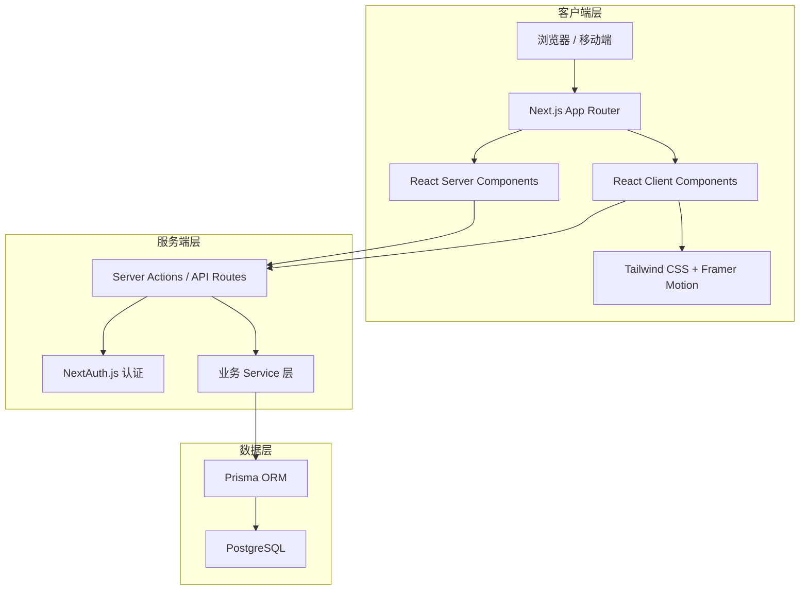
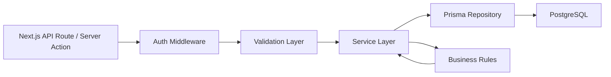
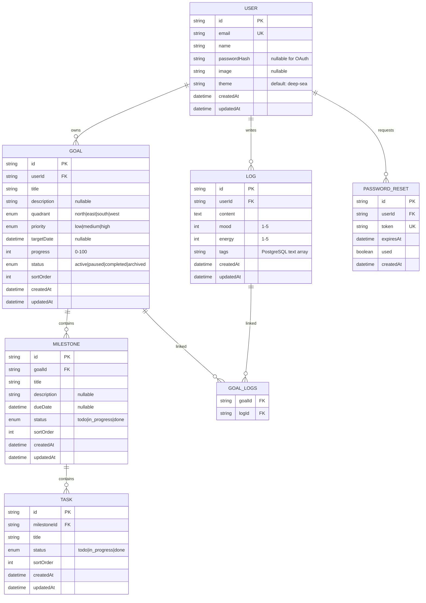
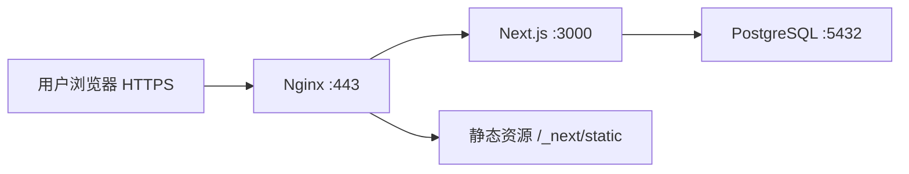

# Compass 技术架构文档

## 1. 架构设计

Compass 采用 **Next.js 14 App Router 全栈架构**，前端使用 React Server Components 与 Client Components 混合渲染，后端使用 Next.js API Routes / Server Actions 处理业务逻辑，PostgreSQL 持久化数据，Prisma 作为 ORM。认证使用 NextAuth.js，UI 使用 Tailwind CSS + Framer Motion。



## 2. 技术说明

- **前端框架**：Next.js 14（App Router），React 18
- **UI 框架**：Tailwind CSS 3.4
- **动画库**：Framer Motion
- **图标库**：Lucide React
- **状态管理**：React useState/useContext（局部状态）+ Server Actions（服务端状态）
- **后端框架**：Next.js API Routes / Server Actions
- **认证方案**：NextAuth.js（Credentials Provider 为主，JWT Session 策略；OAuth 为可选，未配置密钥时前端自动隐藏入口）
- **ORM**：Prisma 5
- **数据库**：PostgreSQL 14+
- **邮件服务**：Nodemailer（SMTP），用于密码重置
- **限流**：基于内存 / Redis 的令牌桶限流（登录、注册、密码重置接口）
- **字体**：Cormorant Garamond、Source Sans 3、JetBrains Mono（通过 next/font）
- **包管理器**：pnpm
- **代码规范**：TypeScript 严格模式、ESLint、Prettier
- **部署目标**：自建 Linux 服务器（Docker Compose 一键部署）

## 3. 路由定义

| 路由 | 用途 | 类型 |
|------|------|------|
| `/` | 落地页 | 页面 |
| `/login` | 登录页（含「忘记密码」入口） | 页面 |
| `/register` | 注册页 | 页面 |
| `/forgot-password` | 申请密码重置：输入邮箱 | 页面 |
| `/reset-password` | 重置密码：通过邮件令牌设置新密码 | 页面 |
| `/onboarding` | 首次引导：创建第一个目标 | 页面（需登录） |
| `/dashboard` | 仪表盘 | 页面（需登录） |
| `/compass` | 罗盘画布：目标可视化 | 页面（需登录） |
| `/voyage` | 航程规划：里程碑与任务 | 页面（需登录） |
| `/voyage/[goalId]` | 单个目标详情 | 页面（需登录） |
| `/logbook` | 日志与复盘 | 页面（需登录） |
| `/profile` | 个人中心 | 页面（需登录） |
| `/api/auth/[...nextauth]` | NextAuth.js 认证接口 | API 路由 |
| `/api/auth/forgot-password` | 发送密码重置邮件 | API 路由（限流） |
| `/api/auth/reset-password` | 校验令牌并重置密码 | API 路由（限流） |
| `/api/health` | 服务健康检查（返回 DB 连通状态） | API 路由 |

## 4. API 定义

### 4.1 目标（Goal）

```typescript
// GET /api/goals
interface ListGoalsResponse {
  goals: Goal[];
}

// POST /api/goals
interface CreateGoalRequest {
  title: string;
  description?: string;
  quadrant: 'north' | 'east' | 'south' | 'west';
  priority: 'low' | 'medium' | 'high';
  targetDate?: string; // ISO 8601
}

interface CreateGoalResponse {
  goal: Goal;
}

// PATCH /api/goals/[id]
interface UpdateGoalRequest {
  title?: string;
  description?: string;
  quadrant?: 'north' | 'east' | 'south' | 'west';
  priority?: 'low' | 'medium' | 'high';
  targetDate?: string;
  progress?: number; // 0-100
  status?: 'active' | 'paused' | 'completed' | 'archived';
}

// DELETE /api/goals/[id]
// 204 No Content
```

### 4.2 里程碑（Milestone）

```typescript
// POST /api/goals/[goalId]/milestones
interface CreateMilestoneRequest {
  title: string;
  description?: string;
  dueDate?: string;
}

// PATCH /api/milestones/[id]
interface UpdateMilestoneRequest {
  title?: string;
  description?: string;
  dueDate?: string;
  status?: 'todo' | 'in_progress' | 'done';
}
```

### 4.3 任务（Task）

```typescript
// POST /api/milestones/[milestoneId]/tasks
interface CreateTaskRequest {
  title: string;
}

// PATCH /api/tasks/[id]
interface UpdateTaskRequest {
  title?: string;
  status?: 'todo' | 'in_progress' | 'done';
}
```

### 4.4 日志（Log）

```typescript
// GET /api/logs?period=week|month
interface ListLogsResponse {
  logs: Log[];
}

// POST /api/logs
interface CreateLogRequest {
  content: string;
  mood: number; // 1-5
  energy: number; // 1-5
  tags: string[];
  goalIds?: string[];
}
```

### 4.5 通用类型

```typescript
interface Goal {
  id: string;
  title: string;
  description?: string;
  quadrant: 'north' | 'east' | 'south' | 'west';
  priority: 'low' | 'medium' | 'high';
  targetDate?: string;
  progress: number;
  status: 'active' | 'paused' | 'completed' | 'archived';
  createdAt: string;
  updatedAt: string;
}

interface Milestone {
  id: string;
  goalId: string;
  title: string;
  description?: string;
  dueDate?: string;
  status: 'todo' | 'in_progress' | 'done';
  createdAt: string;
  updatedAt: string;
}

interface Task {
  id: string;
  milestoneId: string;
  title: string;
  status: 'todo' | 'in_progress' | 'done';
  createdAt: string;
  updatedAt: string;
}

interface Log {
  id: string;
  content: string;
  mood: number;
  energy: number;
  tags: string[];
  goalIds: string[];
  createdAt: string;
  updatedAt: string;
}
```

## 5. 服务端架构图



### 5.1 分层说明

- **API Route / Server Action**：接收 HTTP 请求或直接由组件调用，负责参数解析与响应序列化。
- **Auth Middleware**：校验 JWT Session，注入当前用户 ID，拒绝未授权请求。
- **Validation Layer**：使用 Zod 对请求体进行类型校验与业务规则初筛。
- **Service Layer**：编排业务逻辑，如创建目标时自动初始化第一个里程碑、计算目标进度等。
- **Prisma Repository**：通过 Prisma Client 执行 CRUD，封装复杂查询。
- **Business Rules**：进度计算、状态机转换、权限校验等纯函数。

## 6. 数据模型

### 6.1 数据模型定义



### 6.2 数据定义语言

> 注：实际由 Prisma migration 生成并管理。Prisma 使用 `@default(uuid())` 在应用层生成 UUID，
> DDL 中的 `gen_random_uuid()` 仅供手动建库参考。`updatedAt` 由 Prisma `@updatedAt` 自动维护。

```sql
-- 用户表
CREATE TABLE "User" (
    "id" TEXT PRIMARY KEY DEFAULT gen_random_uuid()::TEXT,
    "email" TEXT UNIQUE NOT NULL,
    "name" TEXT,
    "passwordHash" TEXT,
    "image" TEXT,
    "theme" TEXT NOT NULL DEFAULT 'deep-sea',
    "createdAt" TIMESTAMP(3) NOT NULL DEFAULT CURRENT_TIMESTAMP,
    "updatedAt" TIMESTAMP(3) NOT NULL DEFAULT CURRENT_TIMESTAMP
);

-- 目标表
CREATE TABLE "Goal" (
    "id" TEXT PRIMARY KEY DEFAULT gen_random_uuid()::TEXT,
    "userId" TEXT NOT NULL REFERENCES "User"("id") ON DELETE CASCADE,
    "title" TEXT NOT NULL,
    "description" TEXT,
    "quadrant" TEXT NOT NULL CHECK ("quadrant" IN ('north','east','south','west')),
    "priority" TEXT NOT NULL CHECK ("priority" IN ('low','medium','high')),
    "targetDate" TIMESTAMP(3),
    "progress" INTEGER NOT NULL DEFAULT 0 CHECK ("progress" BETWEEN 0 AND 100),
    "status" TEXT NOT NULL DEFAULT 'active' CHECK ("status" IN ('active','paused','completed','archived')),
    "sortOrder" INTEGER NOT NULL DEFAULT 0,
    "createdAt" TIMESTAMP(3) NOT NULL DEFAULT CURRENT_TIMESTAMP,
    "updatedAt" TIMESTAMP(3) NOT NULL DEFAULT CURRENT_TIMESTAMP
);
CREATE INDEX "Goal_userId_idx" ON "Goal"("userId");
CREATE INDEX "Goal_status_idx" ON "Goal"("status");

-- 里程碑表
CREATE TABLE "Milestone" (
    "id" TEXT PRIMARY KEY DEFAULT gen_random_uuid()::TEXT,
    "goalId" TEXT NOT NULL REFERENCES "Goal"("id") ON DELETE CASCADE,
    "title" TEXT NOT NULL,
    "description" TEXT,
    "dueDate" TIMESTAMP(3),
    "status" TEXT NOT NULL DEFAULT 'todo' CHECK ("status" IN ('todo','in_progress','done')),
    "sortOrder" INTEGER NOT NULL DEFAULT 0,
    "createdAt" TIMESTAMP(3) NOT NULL DEFAULT CURRENT_TIMESTAMP,
    "updatedAt" TIMESTAMP(3) NOT NULL DEFAULT CURRENT_TIMESTAMP
);
CREATE INDEX "Milestone_goalId_idx" ON "Milestone"("goalId");

-- 任务表
CREATE TABLE "Task" (
    "id" TEXT PRIMARY KEY DEFAULT gen_random_uuid()::TEXT,
    "milestoneId" TEXT NOT NULL REFERENCES "Milestone"("id") ON DELETE CASCADE,
    "title" TEXT NOT NULL,
    "status" TEXT NOT NULL DEFAULT 'todo' CHECK ("status" IN ('todo','in_progress','done')),
    "sortOrder" INTEGER NOT NULL DEFAULT 0,
    "createdAt" TIMESTAMP(3) NOT NULL DEFAULT CURRENT_TIMESTAMP,
    "updatedAt" TIMESTAMP(3) NOT NULL DEFAULT CURRENT_TIMESTAMP
);
CREATE INDEX "Task_milestoneId_idx" ON "Task"("milestoneId");

-- 日志表（tags 使用 PostgreSQL 原生数组类型，对应 Prisma String[]）
CREATE TABLE "Log" (
    "id" TEXT PRIMARY KEY DEFAULT gen_random_uuid()::TEXT,
    "userId" TEXT NOT NULL REFERENCES "User"("id") ON DELETE CASCADE,
    "content" TEXT NOT NULL,
    "mood" INTEGER NOT NULL CHECK ("mood" BETWEEN 1 AND 5),
    "energy" INTEGER NOT NULL CHECK ("energy" BETWEEN 1 AND 5),
    "tags" TEXT[] NOT NULL DEFAULT '{}',
    "createdAt" TIMESTAMP(3) NOT NULL DEFAULT CURRENT_TIMESTAMP,
    "updatedAt" TIMESTAMP(3) NOT NULL DEFAULT CURRENT_TIMESTAMP
);
CREATE INDEX "Log_userId_idx" ON "Log"("userId");
CREATE INDEX "Log_createdAt_idx" ON "Log"("createdAt");

-- 日志与目标关联表
CREATE TABLE "GoalLogs" (
    "goalId" TEXT NOT NULL REFERENCES "Goal"("id") ON DELETE CASCADE,
    "logId" TEXT NOT NULL REFERENCES "Log"("id") ON DELETE CASCADE,
    PRIMARY KEY ("goalId", "logId")
);
CREATE INDEX "GoalLogs_logId_idx" ON "GoalLogs"("logId");

-- 密码重置令牌表
CREATE TABLE "PasswordReset" (
    "id" TEXT PRIMARY KEY DEFAULT gen_random_uuid()::TEXT,
    "userId" TEXT NOT NULL REFERENCES "User"("id") ON DELETE CASCADE,
    "token" TEXT UNIQUE NOT NULL,
    "expiresAt" TIMESTAMP(3) NOT NULL,
    "used" BOOLEAN NOT NULL DEFAULT FALSE,
    "createdAt" TIMESTAMP(3) NOT NULL DEFAULT CURRENT_TIMESTAMP
);
CREATE INDEX "PasswordReset_userId_idx" ON "PasswordReset"("userId");
CREATE INDEX "PasswordReset_token_idx" ON "PasswordReset"("token");
```

## 7. 安全与性能

- **认证安全**：密码使用 bcrypt 哈希（cost ≥ 12），NextAuth.js 使用 JWT Session 策略（无需 Adapter 表），`NEXTAUTH_SECRET` 必须配置为强随机值；OAuth 回调地址白名单校验。
- **限流**：登录、注册、密码重置接口限流（如每 IP 每 15 分钟 5 次），使用内存令牌桶或 Redis 实现，防止暴力破解。
- **安全头**：通过 `next.config.js` 的 `headers()` 配置 CSP、X-Frame-Options、X-Content-Type-Options、Referrer-Policy、HSTS。
- **数据隔离**：所有数据查询必须携带 `userId` 过滤，确保用户只能访问自己的数据。
- **输入校验**：所有 API 入参使用 Zod 严格校验，防止注入与非法状态。
- **性能**：为高频查询字段建立索引；仪表盘数据通过 Server Components 直接查询，减少客户端请求；Next.js 配置 `output: 'standalone'` 减小部署体积。
- **错误处理**：统一错误响应格式 `{ error: string, code: string }`，前端根据 code 进行友好提示。

## 8. 部署方案

### 8.1 容器化架构

使用 Docker Compose 一键部署，包含三个服务：Next.js 应用、PostgreSQL、Nginx 反向代理。



### 8.2 Dockerfile（Next.js standalone）

```dockerfile
FROM node:20-alpine AS deps
WORKDIR /app
RUN corepack enable
COPY package.json pnpm-lock.yaml ./
COPY prisma ./prisma
RUN pnpm install --frozen-lockfile

FROM node:20-alpine AS builder
WORKDIR /app
RUN corepack enable
COPY --from=deps /app/node_modules ./node_modules
COPY . .
RUN pnpm prisma generate && pnpm build

FROM node:20-alpine AS runner
WORKDIR /app
ENV NODE_ENV=production
COPY --from=builder /app/.next/standalone ./
COPY --from=builder /app/.next/static ./.next/static
COPY --from=builder /app/public ./public
COPY --from=builder /app/prisma ./prisma
COPY --from=builder /app/node_modules/.prisma ./node_modules/.prisma
EXPOSE 3000
CMD ["node", "server.js"]
```

### 8.3 docker-compose.yml

```yaml
version: "3.9"
services:
  db:
    image: postgres:16-alpine
    restart: always
    environment:
      POSTGRES_DB: compass
      POSTGRES_USER: compass
      POSTGRES_PASSWORD: ${POSTGRES_PASSWORD}
    volumes:
      - pgdata:/var/lib/postgresql/data
    healthcheck:
      test: ["CMD-SHELL", "pg_isready -U compass"]
      interval: 5s
      retries: 5

  app:
    build: .
    restart: always
    depends_on:
      db:
        condition: service_healthy
    environment:
      DATABASE_URL: postgresql://compass:${POSTGRES_PASSWORD}@db:5432/compass
      NEXTAUTH_URL: ${NEXTAUTH_URL}
      NEXTAUTH_SECRET: ${NEXTAUTH_SECRET}
      SMTP_HOST: ${SMTP_HOST}
      SMTP_PORT: ${SMTP_PORT}
      SMTP_USER: ${SMTP_USER}
      SMTP_PASS: ${SMTP_PASS}
      SMTP_FROM: ${SMTP_FROM}
    expose:
      - "3000"

  nginx:
    image: nginx:alpine
    restart: always
    depends_on:
      - app
    ports:
      - "80:80"
      - "443:443"
    volumes:
      - ./nginx.conf:/etc/nginx/conf.d/default.conf:ro
      - ./certs:/etc/nginx/certs:ro

volumes:
  pgdata:
```

### 8.4 Nginx 反向代理配置

```nginx
server {
    listen 80;
    server_name _;
    return 301 https://$host$request_uri;
}

server {
    listen 443 ssl http2;
    server_name your-domain.com;

    ssl_certificate     /etc/nginx/certs/fullchain.pem;
    ssl_certificate_key /etc/nginx/certs/privkey.pem;

    # 安全头
    add_header X-Frame-Options DENY;
    add_header X-Content-Type-Options nosniff;
    add_header Strict-Transport-Security "max-age=63072000" always;

    location / {
        proxy_pass http://app:3000;
        proxy_set_header Host $host;
        proxy_set_header X-Real-IP $remote_addr;
        proxy_set_header X-Forwarded-For $proxy_add_x_forwarded_for;
        proxy_set_header X-Forwarded-Proto $scheme;
    }
}
```

### 8.5 环境变量（.env.example）

```env
# 数据库
POSTGRES_PASSWORD=change-me-to-strong-password
DATABASE_URL=postgresql://compass:change-me-to-strong-password@db:5432/compass

# NextAuth
NEXTAUTH_URL=https://your-domain.com
NEXTAUTH_SECRET=generate-with-openssl-rand-base64-32

# SMTP 邮件（密码重置用）
SMTP_HOST=smtp.example.com
SMTP_PORT=587
SMTP_USER=postmaster@example.com
SMTP_PASS=your-smtp-password
SMTP_FROM=Compass <postmaster@example.com>

# OAuth（可选，不填则前端隐藏 OAuth 入口）
GITHUB_CLIENT_ID=
GITHUB_CLIENT_SECRET=
GOOGLE_CLIENT_ID=
GOOGLE_CLIENT_SECRET=
```

### 8.6 部署步骤

1. 服务器安装 Docker + Docker Compose
2. 克隆仓库，复制 `.env.example` 为 `.env` 并填写真实值
3. 将 SSL 证书放入 `./certs/` 目录（或使用 Let's Encrypt 自动签发）
4. 执行 `docker compose up -d --build`
5. 首次启动后执行 `docker compose exec app pnpm prisma migrate deploy` 初始化数据库
6. 配置域名 DNS 解析到服务器 IP
